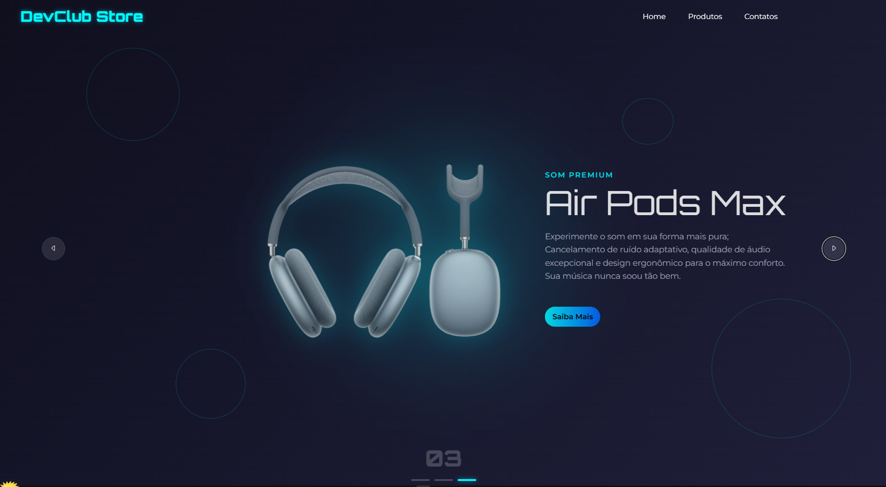

## DevClub Store

Uma interface moderna de loja fictícia desenvolvida com HTML, CSS e JavaScript. Este projeto simula uma vitrine interativa com transições animadas e design futurista.

## Funcionalidades

- Navegação por produtos com botões "Anterior" e "Próximo"
- Destaques animados com transições suaves
- Layout moderno com tipografia personalizada
- Design responsivo pronto para telas desktop

## Tecnologias utilizadas

- HTML5
- CSS3
- JavaScript (DOM, eventos e lógica de carrossel)
- Google Fonts (Orbitron, Montserrat)

## Acessar o projeto online

[https://alexandre-dev01.github.io/devclub-store/]( https://alexandre-dev01.github.io/DevClub-Store/)
